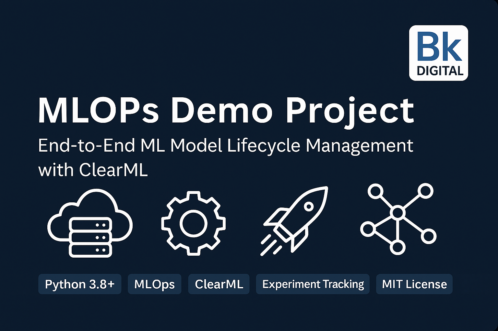

<div align="center">
  
</div>

# 🧠 Iris Classification with ClearML (MLOps Demo)

This project demonstrates how to train ML models (Random Forest & Decision Tree) on the classic Iris dataset and track their performance using [ClearML](https://clear.ml).

✅ Built by: **Bikram Keshari Samal**  
🔗 Powered by: Python · scikit-learn · ClearML · Jupyter · Codespaces
## 📁 Project Structure

## 🔬 Logged Experiments (via ClearML)

All experiments are tracked and visualized in the [ClearML Dashboard](https://app.clear.ml/projects).

| Model            | Accuracy | ClearML Task |
|------------------|----------|-----------------------------|
| Random Forest    | 1.00     | ✅ `Iris - Random Forest` |
| Decision Tree    | 1.00     | ✅ `Iris - Decision Tree`  |

You can view plots, compare metrics, and track parameters side-by-side.


## ⚙️ Setup & Usage

### 📌 1. Install Dependencies
```bash
pip install -r requirements.txt

---

## 🛠 Tech Stack

- Python 3.10+
- scikit-learn
- ClearML (for MLOps experiment tracking)
- Jupyter Notebooks
- GitHub Codespaces

---

## 🙋‍♂️ Author

**Bikram Keshari Samal**  
PMI-Certified | Data Science & MLOps Enthusiast  
📍 India | 🧠 GitHub: [bikramtheitguy](https://github.com/bikramtheitguy)

---

## 🏁 Project Status

✅ Completed Phase 1 (Model training + tracking)  
✅ Notebook version with ClearML logging  
🟡 Upcoming: Streamlit app for real-time predictions

---

## 🌐 Live App

You can test the model yourself via this interactive Streamlit app:


##👉 [🌸 Try it Live: 
Iris Flower Classifier (Decision Tree)](https://iris-mlops-clearml-demo.streamlit.app/)


*Built using Streamlit & DecisionTreeClassifier. Hosted via GitHub Codespaces.*
